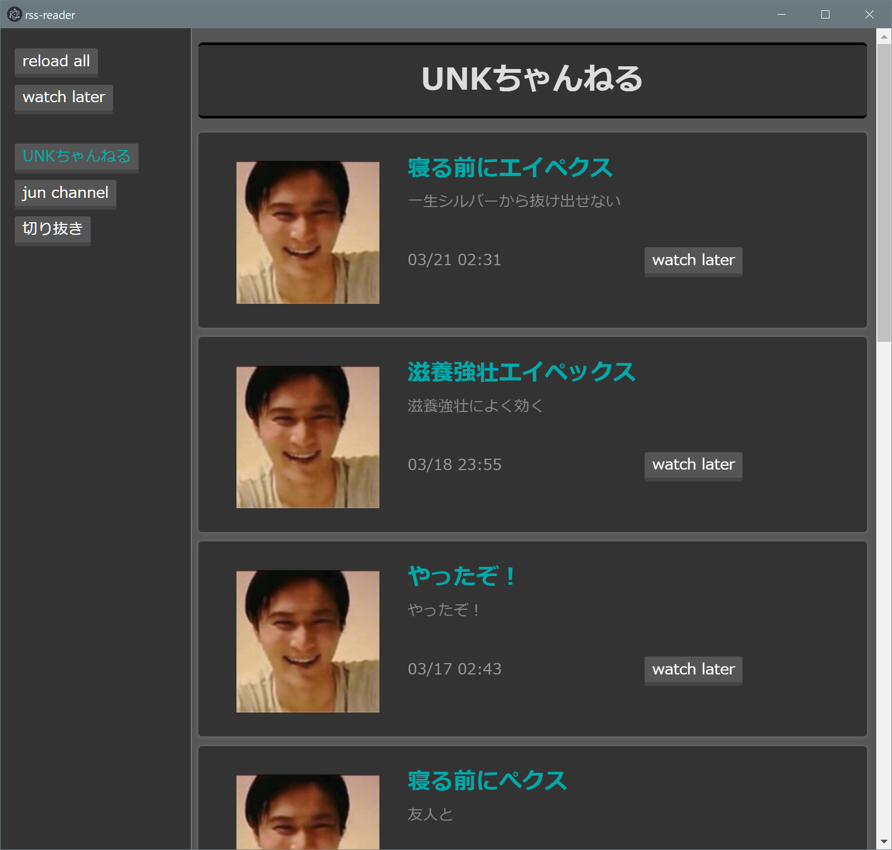

# rss-reader



## Features
- [x] 通知機能
    -  動画が投稿または生放送が始まってから10分以内に通知
    - 通知をクリックするとwatch laterリストに保存
    - youtubeの予約枠の開始時刻に通知できない
- [x] 任意のfeedの登録
    - youtube, ニコニコチャンネル生放送に対応
- [x] 新しく投稿があったチャンネルのハイライト機能
- [x] 後で見ようと思った投稿の記憶機能
- [x] リンクを既定のブラウザで開く


## How to Add Feed
- :%homepath%\AppData\Local\Programs\rss-reader\feedList.csvに追加する
- format
    - 一意の英数字,サイドバーに使われるタイトル,feedのurl
        - youtubeの場合: https://www.youtube.com/feeds/videos.xml?channel_id=?????
        - ニコニコの場合: https://ch.nicovideo.jp/?????/live?rss=2.0


## How to Install
```
npm install --production
npm run electron:build
```

<!--
## 今後追加したい機能
- すべてのfeedを時系列順で並べるページ
- アプリアイコン作成(mac, linux)
- windowサイズの記憶
-->

## License
MIT
