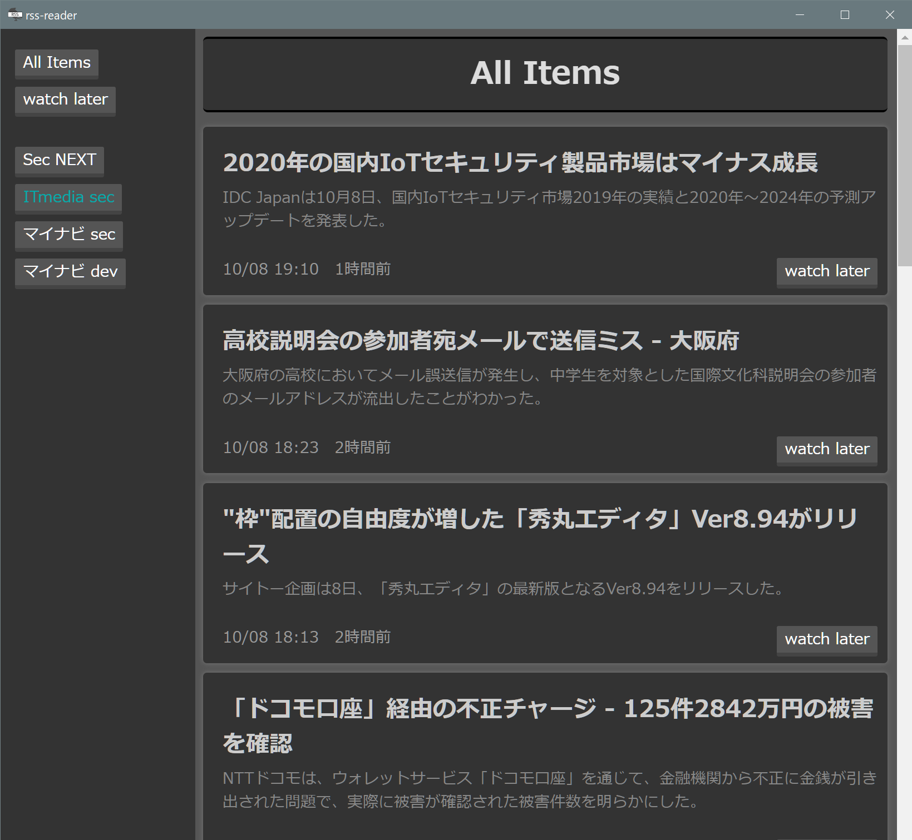

# rss-reader

## sample image



## Features
- [x] 通知機能
    - 動画が投稿または生放送が始まってから10分以内に通知
    - 通知をクリックするとwatch laterリストに保存
- [x] 任意のfeedの登録
- [x] 新しく投稿があったチャンネルのハイライト機能
- [x] 登録した全てのfeedを時系列順にまとめて表示する機能
- [x] 後で見ようと思った投稿の記憶機能
- [x] リンクを既定のブラウザで開く


## How to Add Feed
- feedを管理するファイルの場所
    - windowsの場合
        - `:%homepath%\Documents\.feedList.csv`
    - macの場合
        - `$HOME/Documents/.feedList.csv`
- フォーマット
    - `feed_name,feed_url`
    - .feedList.csv内の空行はサイドバーでも空行となる


## How to Install
```
npm install
npm run electron:build
```
ビルド後，dist_electron内にあるインストーラを実行


## To do
- All itemsにおける 新規feedの色付け機能
- windowサイズの記憶
- 複数インスタンスの起動を禁止
- アプリ内からfeedlistを管理

## License
MIT
